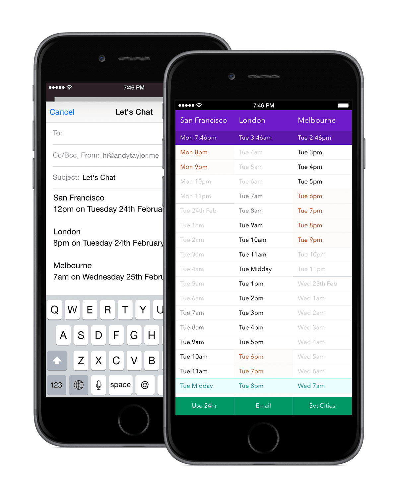

## About

[Homeslice.in](http://homeslice.in) started as a static page to compare two timezones and has evolved into a much more full-featured client side app.

I used [Moment Timezone][1] which uses [The Time Zone Database][2] as the source of city timezone data:

> The Time Zone Database (often called tz or zoneinfo) contains code and data that represent the history of local time for many representative locations around the globe. It is updated periodically to reflect changes made by political bodies to time zone boundaries, UTC offsets, and daylight-saving rules.

Moment Timezone provides a copy of this data from 2010–2020. So times *should* update correctly with daylight savings.

## Adding Cities

If you'd like to request a city, please check out the [list of timezones in the database][4]. Sending me the zone name, e.g. `America/Los_Angeles` is super helpful.

## Development

1. Install [Node][5].
2. Install gulp globally `sudo npm install --global gulp`
3. Install NPM dependencies in the project directory `sudo npm install`.
4. `gulp` to start a local server and watch changes.
5. Open <http://localhost:8000>

### Disabling Application Cache for Development in Chrome

1. Remove `manifest="homeslice.appcache"` from `<html lang="en" manifest="homeslice.appcache">`.
2. Visit <chrome://appcache-internals/> and delete the cache.

## License

Homeslice is licensed under a [Creative Commons Attribution-NonCommercial 4.0 International License][3].

[1]: http://momentjs.com/timezone/
[2]: http://www.iana.org/time-zones
[3]: http://creativecommons.org/licenses/by-nc/4.0/
[4]: http://en.wikipedia.org/wiki/List_of_tz_database_time_zones
[5]: http://nodejs.org

Test adding some stuff to the end.
